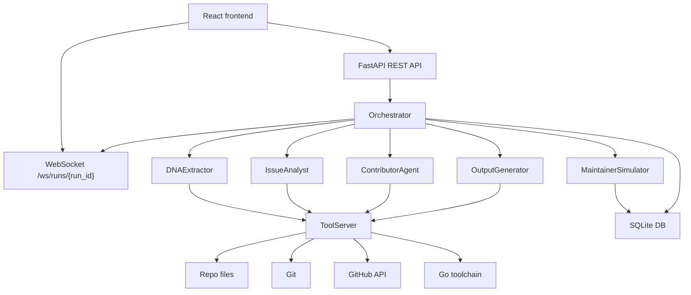

# PRR: Pre-Reviewed Contributor

PRR is an experimental AI coding workflow for GitHub issues. Given a public GitHub issue URL, it clones the repository, studies the project's conventions, plans a fix, implements the change, simulates maintainer review, revises when needed, and produces a final diff plus a pull request description.

The key idea is not just "generate a patch." PRR tries to make the patch feel native to the project by first extracting a **Project Constitution** from the repository and recent merged pull requests, then using that constitution as a hard constraint during implementation and review.

## What It Does

1. **DNA Extractor** studies the repository and creates a Project Constitution:
   - Error handling conventions
   - Naming style
   - Test patterns
   - Import grouping
   - Comment/doc conventions
   - Merged PR norms
   - Red flags to avoid

2. **Issue Analyst** reads the GitHub issue and produces a structured fix plan:
   - Root cause
   - Affected files
   - Related issues and PRs
   - Conservative implementation strategy

3. **Contributor Agent** writes the smallest correct code change and corresponding test.

4. **Maintainer Simulator** reviews the diff as if it were a real maintainer:
   - Blocking comments
   - Suggestions
   - Questions
   - Approval

5. **Output Generator** returns:
   - Final diff
   - Pull request title
   - Pull request body
   - Review transcript

The frontend streams the entire process live, including tool calls, tool results, agent text, revision rounds, review comments, final diff, and generated PR description.

## Repository Layout

```text
PRR/
  backend/
    agents/
      base.py              # Shared Anthropic tool-use loop
      dna_extractor.py     # Stage 1: Project Constitution
      issue_analyst.py     # Stage 2: issue triage and fix plan
      contributor.py       # Stage 3: code implementation
      maintainer.py        # Stage 4: simulated maintainer review
      output_generator.py  # Stage 5: PR description and final output
      orchestrator.py      # End-to-end pipeline coordinator
    api/
      routes.py            # REST API endpoints
      websocket.py         # Per-run WebSocket streaming
    db/
      models.py            # Pydantic data models
      database.py          # Async SQLite persistence layer
    mcp_server/
      server.py            # ToolServer routing layer
      tools/
        file_tools.py      # Safe file read/write/list/search
        git_tools.py       # GitPython helpers
        github_tools.py    # PyGitHub/httpx helpers
        go_tools.py        # go test/vet/build helpers
    config.py              # pydantic-settings config
    main.py                # FastAPI app
    requirements.txt
  frontend/
    src/
      components/
      hooks/
      App.jsx
      index.css
  cache/
  data/
  sample_outputs/
```

## Architecture



## Requirements

- macOS/Linux shell
- Python **3.12** recommended
- Node.js and npm
- Go toolchain available on `PATH` for repositories that need `go test`, `go vet`, and `go build`
- Anthropic API key
- GitHub token with access to the target repository

Python 3.12 matters because the pinned backend dependency `pydantic==2.7.1` depends on `pydantic-core==2.18.2`, which does not build cleanly on Python 3.14 in this environment.

## Backend Setup

From the repository root:

```bash
python3.12 -m venv .venv
source .venv/bin/activate
pip install -r backend/requirements.txt
```

Create a local environment file:

```bash
cp .env.example .env
```

Edit `.env`:

```env
ANTHROPIC_API_KEY=sk-ant-api03-...
GITHUB_TOKEN=ghp_...
```

Optional environment settings:

```env
REPOS_DIR=/tmp/repos
DB_PATH=./data/runs.db
CONSTITUTION_CACHE_DIR=./cache/constitutions
FRONTEND_URL=http://localhost:5173
PORT=8000
MAX_REVISION_ROUNDS=3
MAX_AGENT_ITERATIONS=25
MODEL=claude-sonnet-4-20250514
```

Run the backend:

```bash
source .venv/bin/activate
python -m backend.main
```

The API starts on:

```text
http://localhost:8000
```

## Frontend Setup

From `frontend/`:

```bash
npm install
npm run dev
```

The Vite dev server starts on:

```text
http://localhost:5173
```

The Vite proxy forwards:

- `/api` to `http://localhost:8000`
- `/ws` to `ws://localhost:8000`

## Running the App

1. Start the backend:

   ```bash
   source .venv/bin/activate
   python -m backend.main
   ```

2. Start the frontend:

   ```bash
   cd frontend
   npm run dev
   ```

3. Open:

   ```text
   http://localhost:5173
   ```

4. Paste a GitHub issue URL:

   ```text
   https://github.com/spf13/cobra/issues/123
   ```

5. Watch the run detail page:
   - Pipeline progress
   - Live tool call stream
   - Maintainer review transcript
   - Final diff
   - Generated PR description

## API

The backend exposes all REST routes under `/api`.

### Create Run

```http
POST /api/runs
Content-Type: application/json

{
  "issue_url": "https://github.com/owner/repo/issues/123"
}
```

Response:

```json
{
  "run_id": "uuid",
  "status": "pending"
}
```

The API validates the URL, creates a pending run, then starts the pipeline in the background.

### Get Run

```http
GET /api/runs/{run_id}
```

Returns the run record, stage results, maintainer comments, and final result if completed.

### List Runs

```http
GET /api/runs
```

Returns the latest 20 runs, newest first.

### Get Cached Constitution

```http
GET /api/constitutions/{owner}/{repo}
```

Returns the cached Project Constitution for a repository, or `404` if none exists yet.

## WebSocket Events

Run streaming uses:

```text
ws://localhost:8000/ws/runs/{run_id}
```

When using the Vite frontend, connect through:

```text
/ws/runs/{run_id}
```

Common event types:

| Event | Purpose |
| --- | --- |
| `stage_start` | Marks a pipeline stage as running |
| `stage_complete` | Marks a stage as complete |
| `revision_start` | Begins a contributor/maintainer revision round |
| `tool_call` | Shows a tool invocation requested by Claude |
| `tool_result` | Shows the result of a tool invocation |
| `agent_text` | Streams agent text output |
| `review_comment` | Emits maintainer review comments |
| `run_complete` | Sends final diff, PR title/body, and review transcript |
| `run_error` | Sends failure details |

If a client connects after a run has completed or failed, the websocket sends the stored final result or error immediately.

## Agent Pipeline

### 1. DNA Extractor

File:

```text
backend/agents/dna_extractor.py
```

Builds the Project Constitution by reading repository files, searching code patterns, and inspecting merged PRs.

The constitution is cached by repository key:

```text
owner/repo
```

### 2. Issue Analyst

File:

```text
backend/agents/issue_analyst.py
```

Reads the issue, searches code, inspects file history, and finds related issues/PRs.

### 3. Contributor Agent

File:

```text
backend/agents/contributor.py
```

Writes the actual code fix. It is constrained to:

- Smallest correct change
- Test coverage for every code change
- Project Constitution conventions
- `go test`
- `go vet`

### 4. Maintainer Simulator

File:

```text
backend/agents/maintainer.py
```

Reviews the diff without write access and emits structured comments:

- `[BLOCKING]`
- `[SUGGESTION]`
- `[QUESTION]`
- `[APPROVED]`

Blocking comments are fed back to the Contributor Agent for the next revision round.

### 5. Output Generator

File:

```text
backend/agents/output_generator.py
```

Produces the final pull request title and body, using the diff, issue analysis, review transcript, and project PR norms.

## Tool Server

The `ToolServer` is the execution layer for Claude tool-use blocks.

File:

```text
backend/mcp_server/server.py
```

When Claude asks to use a tool, the agent base loop calls:

```python
await tool_server.call_tool(name, arguments)
```

Supported tool groups:

- File tools:
  - `read_file`
  - `write_file`
  - `list_files`
  - `search_code`
  - `file_exists`

- Go tools:
  - `run_tests`
  - `run_vet`
  - `run_build`

- Git tools:
  - `git_diff`
  - `git_log`
  - `git_status`
  - `git_blame`

- GitHub tools:
  - `get_issue`
  - `search_prs`
  - `get_pr_diff`
  - `get_pr_comments`
  - `search_issues`

File operations are path-safe: resolved child paths must remain inside the cloned repository, otherwise the tool raises:

```text
Path traversal not allowed
```

## Database

PRR uses SQLite through `aiosqlite`.

Default database path:

```text
./data/runs.db
```

Tables:

- `runs`
- `stage_results`
- `review_comments`
- `constitutions`

Models live in:

```text
backend/db/models.py
```

Async database functions live in:

```text
backend/db/database.py
```

## Frontend Components

Important components:

- `IssueInput.jsx`: home screen issue URL input
- `PipelineProgress.jsx`: stage progress pills
- `StreamingFeed.jsx`: transparent live log of agent activity
- `ReviewTranscript.jsx`: grouped maintainer review rounds
- `DiffViewer.jsx`: final diff with copy button
- `PRPreview.jsx`: GitHub-like PR title/body preview
- `RunDetail.jsx`: run detail composition

The app uses hash routing:

```text
#/              home
#/run/{run_id}  run detail
```

## Development Commands

Backend:

```bash
source .venv/bin/activate
python -m backend.main
```

Frontend:

```bash
cd frontend
npm run dev
npm run lint
npm run build
```

Smoke checks used during development:

```bash
source .venv/bin/activate
python -m py_compile backend/agents/*.py backend/api/*.py backend/db/*.py
cd frontend && npm run lint && npm run build
```

## Known Limitations

- The system currently generates a diff and PR description; it does not open a pull request automatically.
- The repo is cloned into `REPOS_DIR` using a tokenized HTTPS URL.
- Live end-to-end runs require network access to GitHub and Anthropic.
- Target repositories must have the relevant language toolchain installed locally. For current Go workflows, `go` must be on `PATH`.
- The maintainer review is simulated by an LLM. It is useful for pre-review, but it is not a substitute for an actual project maintainer.
- The frontend intentionally keeps PR opening manual.

## Security Notes

- Do not commit `.env`.
- GitHub and Anthropic tokens are loaded from environment variables.
- Tool file access is constrained to the cloned repository path.
- The Contributor Agent is instructed to make changes only through the ToolServer.
- Running against untrusted repositories still executes project tests/builds locally. Use an isolated environment for high-risk repositories.

## Current Status

Implemented:

- Backend FastAPI app
- Async SQLite persistence
- ToolServer and tools
- Five agent stages
- Orchestrator
- REST API and WebSocket streaming
- React frontend with live stream, review transcript, diff viewer, and PR preview

Verified locally:

- Backend modules compile
- Database round trips work in temp SQLite files
- Mocked agent/orchestrator flows work
- Frontend lint passes
- Frontend production build passes

Not yet verified end-to-end against a real GitHub issue in this workspace:

- Real repository clone
- Real Anthropic tool-use loop
- Real Go test/vet/build execution on a target project
